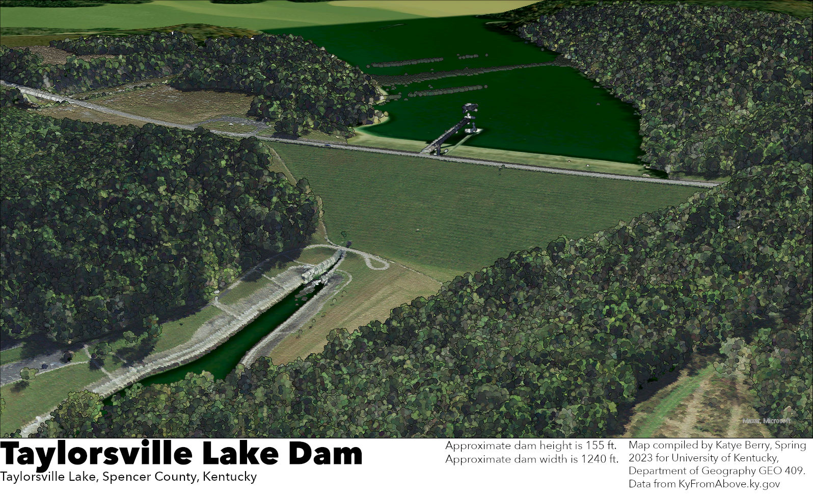
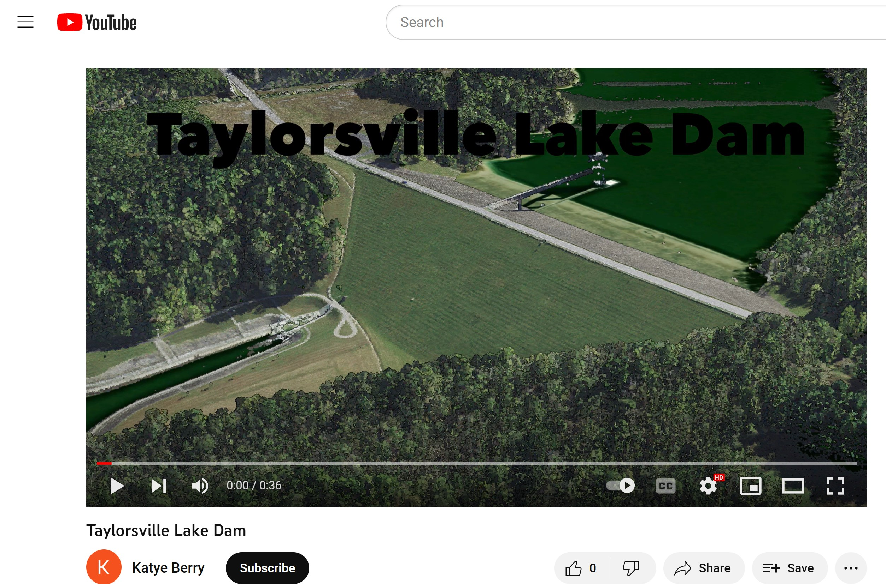
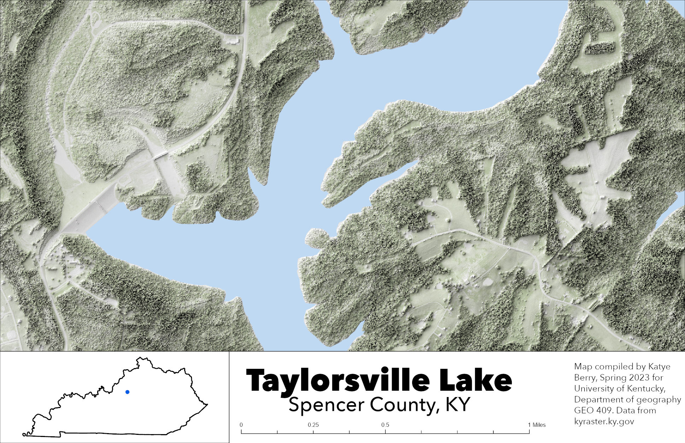
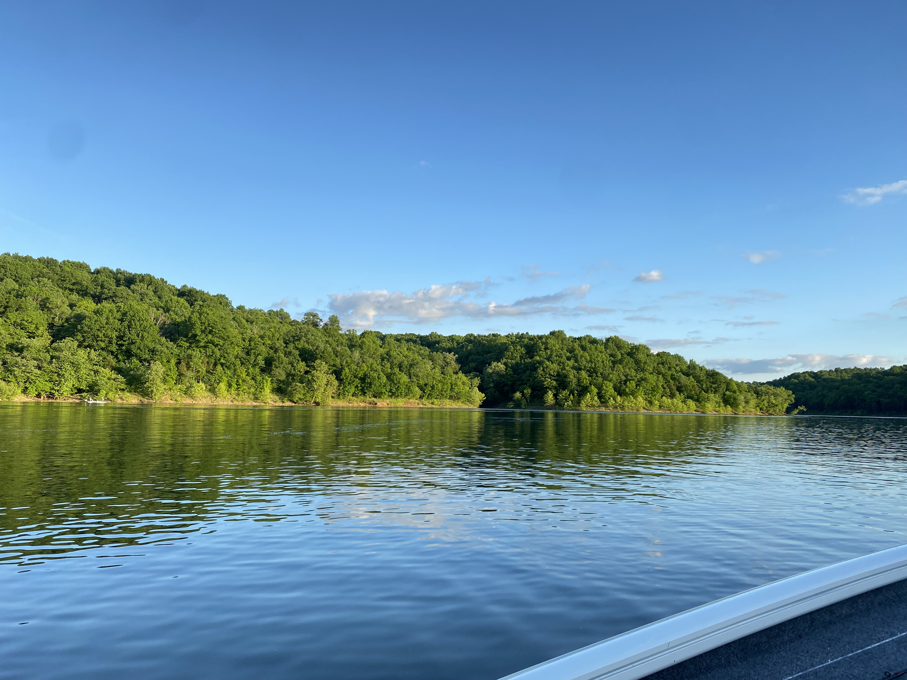
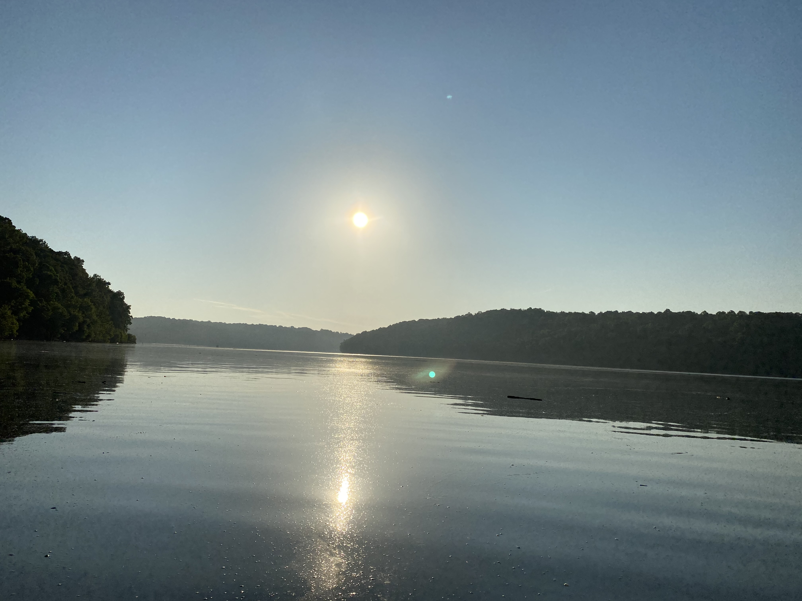
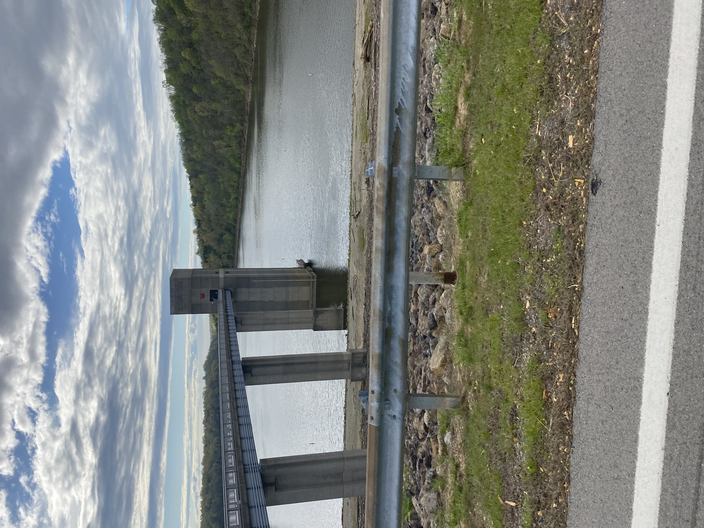
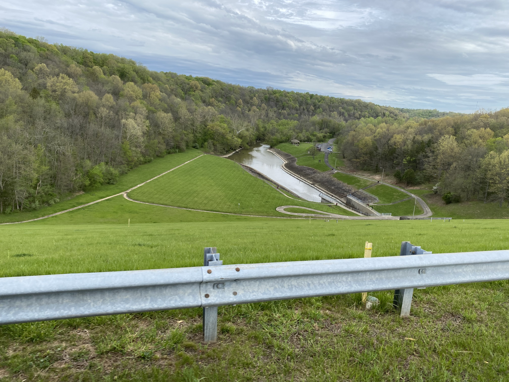

# TaylorsvilleLake
Taylorsville Lake is located in Spencer County, KY and has primary purposes including flood control, water storage, outdoor recreation and fish and wildlife preservation. 

     
*Taylorsville Lake Dam*

     
*[Taylorsville Lake Dam Flyover](https://youtu.be/Uk7ZaWG7X6E)*

     
*Shaded Relief Taylorsville Lake Dam*

[Shaded Relief Taylorsville Lake Dam](mapSR.pdf) 

     
*Taylorsville Lake close to Chowning Lane Boat Ramp looking Northwest*    

     
*Taylorsville Lake close to Van Buren Boat Ramp looking East*   

     
*Taylorsville Lake View from the bottom of the dam looking Southeast*  

      
*Taylorsville Lake Outflow Control Tower*  

      
*Taylorsville Lake Spillway* 

Maps produced by Katye Berry, Spring 2023 for University of Kentucky, Department of Geography GEO409. Data from KyFromAbove.ky.gov and kyraster.ky.gov. ArcGIS and Blender were used to process data and create maps. All images taken by Katye Berry. 
